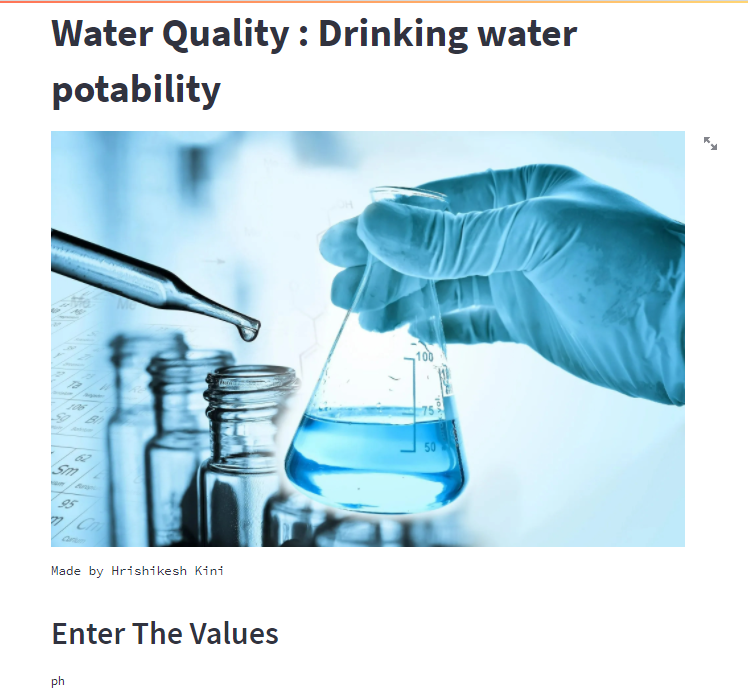
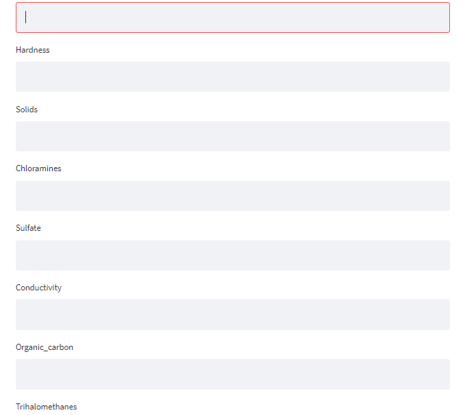

# Water Quality : Drinking water potability

## Table of Content
  * [Demo](#demo)
  * [Problem Statement](#problem-statement)
  * [Approach](#approach)
  * [Technologies Used](#technologies-used)
  * [Installation](#installation)
  * [Deployement on Heroku](#deployement-on-heroku)
  * [Detailed Project Reports](#detailed-project-reports)
  * [Bugs & Logs](#bugs--logs)
  * [Contributors](#contributors)

## Demo
Link: [https://drinkingwaterpotability.herokuapp.com/](https://drinkingwaterpotability.herokuapp.com/)

## Youtube
[](http://www.youtube.com/watch?v=9fGcEExGdQQ "IBM Coursera Advanced Data Science Capstone – HRISHIKESH KINI")

## Screenshots




## Problem Statement
Contaminated water and poor sanitation are linked to transmission of diseases such as cholera, diarrhoea, dysentery, hepatitis A, typhoid, and polio. Absent, inadequate, or inappropriately managed water and sanitation services expose individuals to preventable health risks. This is particularly the case in health care facilities where both patients and staff are placed at additional risk of infection and disease when water, sanitation, and hygiene services are lacking. Globally, 15% of patients develop an infection during a hospital stay, with the proportion much greater in low-income countries.

So, I took some inspiration from this to use this Water Quality dataset to understand what consitutes to safe, Potable water and apply machine learning to it to distinguish between Potable and Non-Potable water.

## Approach
Data Exploration : I started exploring dataset using pandas,numpy,matplotlib and seaborn.

Data visualization : Ploted graphs to get insights about dependend and independed variables.

Feature Engineering : Removed missing values and created new features as per insights.

Model Building & Testing : Tried many machine learning algorithms and checked the base accuracy to find the best fit.

User Interface & deployment :  Created an UI with a form that takes all the necessary inputs from user and shows the output.
                          After that I have deployed project on heroku. The model has been deployed on ibm cloud machine learning.
## Technologies Used
 
   1. Python 
   2. Sklearn
   3. Tensorflow
   4. Pandas, Numpy 
   5. Streamlit
   6. heroku cloud
   7. ibm cloud

## Dataset
[Download here](https://www.kaggle.com/adityakadiwal/water-potability/download)

## Installation
Click here to install [python](https://www.python.org/downloads/). To install the required packages and libraries, run this pip command in the project directory after cloning the repository:
```bash
git clone https://github.com/hrishikeshkini/Water-Quality-Drinking-water-potability.git
pip install -r requirements.txt
```
If pip is not already installed, Follow this [link](https://pip.pypa.io/en/stable/installation/)

## Deployement on Heroku
Create a virtual app on Heroku website. You can either connect your github profile or download cli to manually deploy this project.
Follow the instruction given on [Heroku Documentation](https://devcenter.heroku.com/articles/getting-started-with-python) to deploy a web app.

## Bugs & Logs

1. If you find a bug, kindly open an issue and it will be addressed as early as possible. [Open](https://github.com/hrishikeshkini/Water-Quality-Drinking-water-potability/issues)
2. Under localhost, logging is performed for all the actions and its stored onto logs.txt file
3. When the app is deployed on heroku, logs can be viewed on  heroku dashboard or CLI.

## Contributors
  [Hrishikesh Kini](https://github.com/hrishikeshkini)
